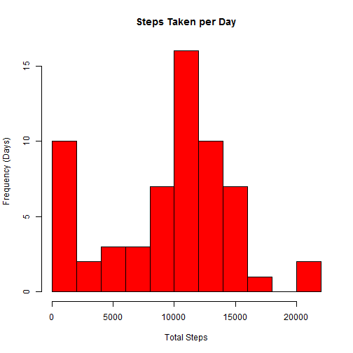
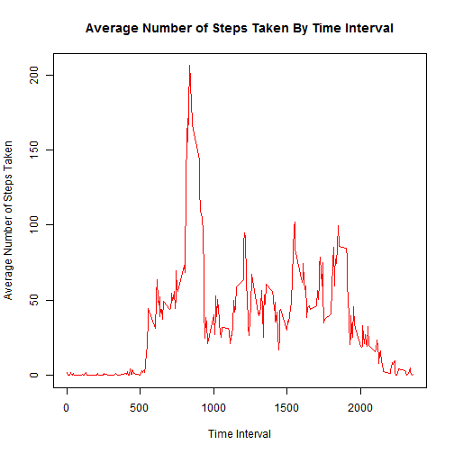
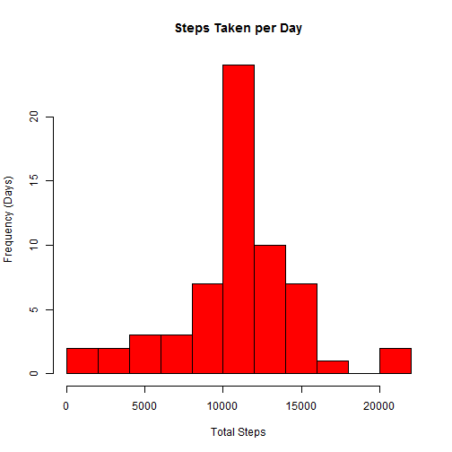
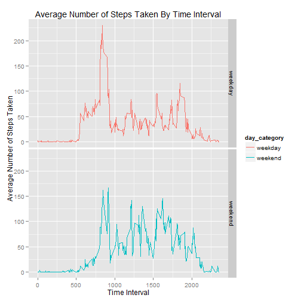
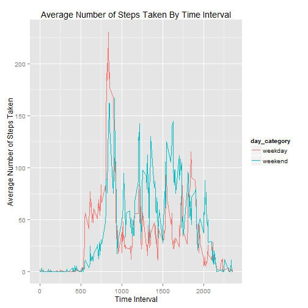

Coursera - Reproducible Research
================================
### Peer Assessment 1
### June 14, 2014
--------------------------------

---------------------------------------------------------------------
Cleanup
---------------------------------------------------------------------

```r
rm(list=ls(all=TRUE))
```
---------------------------------------------------------------------
Set up environment
---------------------------------------------------------------------

```r
setwd("C:/R/Code/repdata/PA1")
library(ggplot2)
```
---------------------------------------------------------------------
Read source data
---------------------------------------------------------------------

```r
activity_data_raw <- read.csv("activity.csv", header = TRUE)
```
---------------------------------------------------------------------
Remove NA's
---------------------------------------------------------------------

```r
activity_data <- activity_data_raw[!is.na(activity_data_raw$steps),]
```
---------------------------------------------------------------------
Summarize the data
---------------------------------------------------------------------

```r
summary(activity_data_raw)
```

```
##      steps               date          interval   
##  Min.   :  0.0   2012-10-01:  288   Min.   :   0  
##  1st Qu.:  0.0   2012-10-02:  288   1st Qu.: 589  
##  Median :  0.0   2012-10-03:  288   Median :1178  
##  Mean   : 37.4   2012-10-04:  288   Mean   :1178  
##  3rd Qu.: 12.0   2012-10-05:  288   3rd Qu.:1766  
##  Max.   :806.0   2012-10-06:  288   Max.   :2355  
##  NA's   :2304    (Other)   :15840
```

```r
summary(activity_data)     # NA's removed
```

```
##      steps               date          interval   
##  Min.   :  0.0   2012-10-02:  288   Min.   :   0  
##  1st Qu.:  0.0   2012-10-03:  288   1st Qu.: 589  
##  Median :  0.0   2012-10-04:  288   Median :1178  
##  Mean   : 37.4   2012-10-05:  288   Mean   :1178  
##  3rd Qu.: 12.0   2012-10-06:  288   3rd Qu.:1766  
##  Max.   :806.0   2012-10-07:  288   Max.   :2355  
##                  (Other)   :13536
```
---------------------------------------------------------------------
Total steps taken per day analysis (missing data removed)
---------------------------------------------------------------------

```r
steps_per_day <- data.frame(xtabs(steps ~ date, data=activity_data))
hist (steps_per_day$Freq, col="red", main="Steps Taken per Day", xlab="Total Steps", ylab= "Frequency (Days)", breaks=10)
```

 

The **mean** and **median** total number of steps taken per day is shown below:

```r
summary(steps_per_day$Freq)
```

```
##    Min. 1st Qu.  Median    Mean 3rd Qu.    Max. 
##       0    6780   10400    9350   12800   21200
```
---------------------------------------------------------------------
Average steps taken per time interval analysis (missing data removed)
---------------------------------------------------------------------

```r
steps_per_interval <- data.frame(xtabs(steps ~ interval, aggregate(steps ~ interval,data=activity_data,mean)))
steps_per_interval$time_interval <- as.numeric(levels(steps_per_interval$interval))[steps_per_interval$interval] # numeric <- factor

plot(Freq ~ time_interval,
     data=steps_per_interval,
     type="l",
     pch=22,
     col = "red",
     main="Average Number of Steps Taken By Time Interval",
     xlab="Time Interval",
     ylab="Average Number of Steps Taken" )
```

 

The **5-minute interval**, that on average across all the days in the dataset, contains the **maximum number of steps** is shown below:

```r
max_steps <- max(steps_per_interval$Freq)
steps_per_interval_max <- steps_per_interval[steps_per_interval$Freq == max_steps,]
max_interval <- steps_per_interval_max$time_interval
paste("5-minute interval:",max_interval)
```

```
## [1] "5-minute interval: 835"
```
---------------------------------------------------------------------
Imputing missing values
---------------------------------------------------------------------

**Imputing Strategy** - It was decided to impute the missing data using the average number of steps for the same time interval (across all dates), based on available data.

```r
activity_data_missing <- activity_data_raw[is.na(activity_data_raw$steps),]
impute_missing <- merge(activity_data_missing, steps_per_interval) # impute missing values using average interval steps
impute_missing$steps <- impute_missing$Freq
activity_data_imputed <- impute_missing[,c('steps','date','interval')]
activity_data_full <- rbind(activity_data, activity_data_imputed)
paste("Data has been imputed for **", nrow(activity_data_missing), "** missing rows.")
```

```
## [1] "Data has been imputed for ** 2304 ** missing rows."
```
---------------------------------------------------------------------
Total steps taken per day analysis (using imputed data)
---------------------------------------------------------------------

```r
steps_per_day_imputed <- data.frame(xtabs(steps ~ date, data=activity_data_full))
hist (steps_per_day_imputed$Freq, col="red", main="Steps Taken per Day", xlab="Total Steps", ylab= "Frequency (Days)", breaks=10)
```

 

The **mean** and **median** total number of steps taken per day **(including imputed data)** is shown below:

```r
summary(steps_per_day_imputed$Freq)
```

```
##    Min. 1st Qu.  Median    Mean 3rd Qu.    Max. 
##      41    9820   10800   10800   12800   21200
```
Compare these statistics to the same statistics derived from the dataset with **missing data removed**:

```r
summary(steps_per_day$Freq)
```

```
##    Min. 1st Qu.  Median    Mean 3rd Qu.    Max. 
##       0    6780   10400    9350   12800   21200
```
Imputing the missing data had a significant affect on both the first quartile and the mean, with little to no effect on the third quartile. In both cases, the first quartile and mean were significantly increased.

---------------------------------------------------------------------
 Are there differences in activity patterns - weekdays vs weekends?
---------------------------------------------------------------------

```r
activity_data_full$date2 <- as.Date(activity_data_full$date, format="%Y-%m-%d")
activity_data_full$weekday <- weekdays(activity_data_full$date2)
activity_data_full$day_category <- ifelse(activity_data_full$weekday == "Saturday" 
                                                   | activity_data_full$weekday == "Sunday" , c("weekend"), c("weekday"))

steps_per_interval <- data.frame(xtabs(steps ~ interval+day_category, aggregate(steps ~ interval+day_category,data=activity_data_full,mean)))
steps_per_interval$time_interval <- as.numeric(levels(steps_per_interval$interval))[steps_per_interval$interval] # numeric <- factor

qplot(data=steps_per_interval, 
      y=Freq, 
      x=time_interval, 
      facets=day_category~.,
      color=day_category,
      geom="line",
      main="Average Number of Steps Taken By Time Interval",
      xlab="Time Interval",
      ylab="Average Number of Steps Taken" 
      )
```

 

In order to more easily compare activity patterns between weekdays and weekends, both factors were plotted on the same chart.

```r
qplot(data=steps_per_interval, 
      y=Freq, 
      x=time_interval, 
      color=day_category,
      geom="line",
      main="Average Number of Steps Taken By Time Interval",
      xlab="Time Interval",
      ylab="Average Number of Steps Taken" 
      )
```

 

When comparing the activity patterns between weekdays and weekends, a couple of interesting facts appear:
  1. Activity levels during weekend morning hours is less than those on the weekday.
  2. Activity levels during weekend afternoon hours is greater than those on the weekday.
  3. Peak activity for both the weekends and weekdays occurs around the noon hour.
